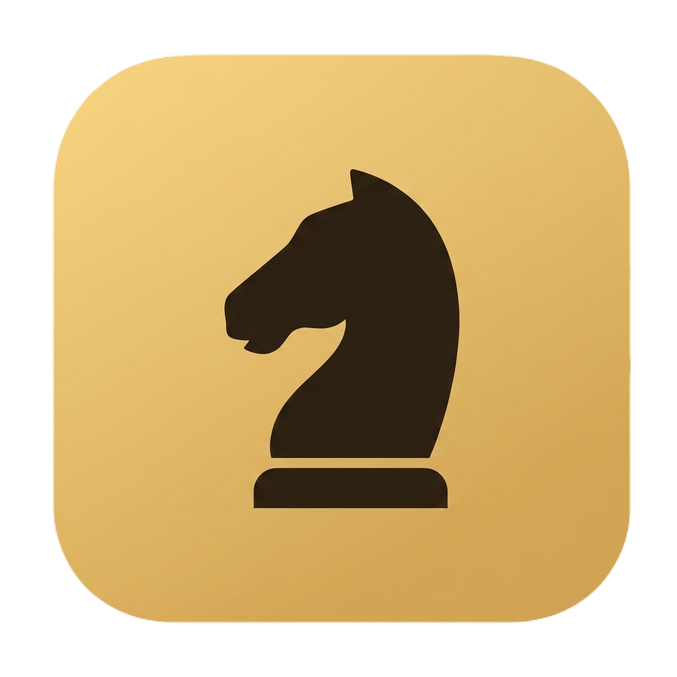

<p align="center">
  <h1 align="center">♞ Gambit · Chess Room</h1>
</p>

<p align="center">
  <em>Sixty-four squares, no mercy.</em>
</p>

**Gambit** is a lightweight, offline-first desktop chess application for Windows, built with Electron. Challenge a built-in engine with four distinct difficulty personalities, pass the keyboard to a friend, or duel another computer over your local network — with automatic player discovery, live chat, clocks, hints, move review, PGN export and a hand-crafted, themeable interface. No accounts. No servers. No internet required. Everything runs on your machine.

<p align="center">
  
  
  
  
  
  
</p>

<p align="center">
  
</p>

<p align="center">
  <a href="https://github.com/guiltysun/gambit-chess/releases/download/v1.0.0/Gambit-Chess-1.0.0-Portable.exe">
    
  </a>
  <a href="https://github.com/guiltysun/gambit-chess/releases/latest">
    
  </a>
</p>

---

### 📑 Table of Contents

<details open>
<summary>Click to expand</summary>

- [⚡ Quick Install](#quick-install)
- [🚀 First-Time Launch Instructions](#first-time-launch-instructions)
- [🖥️ Overview](#overview)
- [✨ Features (v1.0.0)](#features-v100)
- [⌨️ Keyboard Shortcuts](#keyboard-shortcuts)
- [🌐 LAN Multiplayer Guide](#lan-multiplayer-guide)
- [🧰 Tech Stack](#tech-stack)
- [🗂️ Project Structure](#project-structure)
- [🛠️ Development (Building from Source)](#development-building-from-source)
- [🧯 Troubleshooting](#troubleshooting)
- [🗺️ Roadmap](#roadmap)
- [️ License](#license)
- [💛 Credits & Support](#credits-support)

</details>

---

## ⚡ Quick Install

You **don't need a terminal, Node.js, or any programming tools** to play. Grab the pre-built portable executable for your platform and run it — that's it. Gambit ships as a **single portable file**: nothing is installed, no registry keys are touched, and you can carry it on a USB stick.

| 🖥️ Platform | 📦 Installer |  Architecture | ️ Download |
|:---:|:---:|:---:|:---:|
| Windows 10 / 11 | Portable `.exe` (no install needed) | x64 | [**Gambit-Chess-1.0.0-Portable.exe**](https://github.com/guiltysun/gambit-chess/releases/download/v1.0.0/Gambit-Chess-1.0.0-Portable.exe) |

> 💡 **Portable = zero setup.** The file runs directly from anywhere: Desktop, Downloads, or a USB drive. To "uninstall", simply delete the file.

---

## 🚀 First-Time Launch Instructions

1. **Download** the `.exe` from the table above (or the [Releases page](https://github.com/guiltysun/gambit-chess/releases)).
2. **Double-click** `Gambit-Chess-1.0.0-Portable.exe`.
3. **Windows SmartScreen may appear** saying *"Windows protected your PC"*. This is normal for independent, unsigned software — it does **not** mean the app is dangerous.
   - Click **`More info`** → then click **`Run anyway`**.
4. The app opens immediately. Pick a mode in **Game setup** (Friend / Engine / Network) and press **`+ New game`**.
5. **Hosting a LAN game?** The first time you open a table, Windows Firewall may ask for permission — click **Allow access** so other devices on your network can find you.
6. *(Optional)* Right-click the exe → **Pin to taskbar** for quick access, or create a desktop shortcut.

> 🔐 Only ever download Gambit from this official repository to guarantee you're running the authentic build.

---

## 🖥️ Overview

Gambit is designed around a clean three-panel arena:

- **Left panel — Game setup:** opponent mode, engine strength, side selection, time control, board themes and preferences.
- **Center — The arena:** a framed wooden board with player bars (names, captured pieces, material advantage, live clocks), a static evaluation bar, and turn/status indicators.
- **Right panel — Notation & tools:** full move list in standard algebraic notation (SAN), move review controls, table tools (undo, hint, draw, resign, flip, PGN/FEN export) and — in network mode — a live table chat.

Everything is rendered with hand-drawn inline SVG pieces, a custom CSS design system, and synthesized audio. There is **no backend and no telemetry**: engine games and pass-&-play run 100% offline, and network games travel only across your own local network.

---

## ✨ Features (v1.0.0)

### ♟️ Three Game Modes
- **👥 Pass & Play** — two humans, one keyboard, with optional auto-flip of the board after every move.
- **🤖 vs Engine** — a built-in chess engine with **four personalities**:
  - **Novice** — learning the ropes, expects gifts.
  - **Casual** — relaxed club play with occasional slips.
  - **Club** — solid tactics, punishes mistakes.
  - **Expert** — deep calculation, bring your best.
  - Play as **White**, **Black**, or **Random**.
- **🌐 Network (LAN)** — host a table or join a friend on the same network with **automatic player discovery**, side selection, live chat and negotiated actions.

### 🧠 Custom Chess Engine
- **Negamax search** with **alpha-beta pruning**.
- **Quiescence search** to avoid horizon-effect blunders.
- **Piece-square tables** for positional understanding (centralization, king safety, pawn structure).
- **Move ordering** (MVV-LVA style) for faster, deeper search.
- **Human-like imperfection** at lower levels — Novice and Casual occasionally choose sub-optimal moves so games feel natural.
- **Hint system** — one click highlights the engine's suggested move for 2 seconds.

### 🌐 LAN Multiplayer
- **UDP broadcast discovery** (port `47501`) — hosts announce themselves every 2 seconds; joiners see live tables appear with one click of **Scan for players**.
- **WebSocket game channel** (port `47500`) — low-latency, bidirectional move sync.
- **Manual IP fallback** for networks where broadcasts are blocked.
- **Table chat** with per-player names.
- **Negotiated actions:** undo requests, draw offers and rematches must be accepted by the opponent.
- **Disconnect detection** — you're notified instantly if your opponent leaves or drops.
- **Hard cap of 2 players** per table — no accidental third-wheel joins.

### ⏱️ Clocks & Time Controls
- **Five options:** No clock ∙ **1′ bullet** ∙ **3+2 blitz** (with increment) ∙ **5′ blitz** ∙ **10′ rapid**.
- Increment is applied the moment you move.
- Clocks pulse **red under 15 seconds**.
- Flag fall ends the game on timeout — in network mode both clients agree on the result.

### 🎨 Themes & Appearance
- **Six board themes:** Walnut 🌰, Tournament 🌿, Midnight 🌙, Graphite ⬛, Rosewood 🌹, Amethyst 🔮 — each with a matching wooden frame.
- **Dark & Light UI modes** with smooth transitions.
- Animated floating chess glyphs and radial glow background.
- Fully **responsive layout** (desktop → laptop → tablet) and `prefers-reduced-motion` support.

### 🕹️ Fluid Controls & UX
- **Click-to-move** *and* **drag & drop** with a floating ghost piece.
- **Legal-move dots** and **capture rings** on selected pieces.
- **Last-move highlight**, **check pulse**, and **hint glow**.
- **Promotion picker** (Queen / Rook / Bishop / Knight) with cancel.
- Smooth **glide & pop animations** for moves and new games.
- **Synthesized sound effects** (move, capture, check, game end, illegal) generated with the Web Audio API — zero audio files, zero downloads.
- Editable player names, captured-piece trays, and live **material advantage** counter.
- Confirmation dialogs for destructive actions (resign, disconnect, new game mid-play).
- Toast notifications and a built-in **keyboard shortcuts** help overlay.

### 📊 Live Analysis
- **Static evaluation bar** with numeric score (material + position).
- **Thinking indicator** while the engine calculates.
- Active-player bar highlighted in gold.

### 📜 Notation, Review & Export
- Full **SAN notation** with disambiguation, `+` and `#` suffixes.
- **Clickable move list** — jump to any position instantly.
- **Review mode** with ⏮ ◀ ▶ and **Live** controls, plus arrow-key navigation.
- **Copy PGN** / **Download .pgn** with proper headers (Event, Date, White, Black, Result).
- **Copy FEN** of the current position for use in other tools.

### 🏁 Complete Rules Enforcement
- Legal move generation with **castling** (through-check validation), **en passant**, and **promotion**.
- **Checkmate** and **stalemate** detection.
- Automatic draws: **fifty-move rule**, **threefold repetition**, **insufficient material** (including bishop-color analysis).
- Wins by **timeout**, **resignation**, and **disconnection**.

### 🔒 Private by Design
- No accounts, no servers, no telemetry, no internet requirement.
- Network play never leaves your local network.
- Secure Electron architecture: `contextIsolation: true`, `nodeIntegration: false`, minimal `contextBridge` API.

---

## ⌨️ Keyboard Shortcuts

| Key | Action |
|:---:|:---|
| `F` | Flip the board |
| `U` | Undo (or send undo request in network mode) |
| `N` | New game |
| `←` / `→` | Review previous / next move |
| `Esc` | Deselect piece / close dialogs |

---

## 🌐 LAN Multiplayer Guide

**🅰️ Hosting a table**
1. Switch Opponent to **Network** → Role: **Host game**.
2. Enter your name, pick your side, press **Open table & wait**.
3. Your address (`IP:47500`) is displayed — share it, or let discovery do the work.

**🅱️ Joining a table**
1. Switch Opponent to **Network** → Role: **Join game**.
2. Press **Scan for players** — open tables on your network appear automatically. Click one to join.
3. No luck? Expand **Advanced: Manual IP** and type the host's address.

> ⚠️ Both devices must be on the **same local network** (same router). Guest/clients-isolated Wi-Fi networks block discovery.

---

## 🧰 Tech Stack

| Layer | Technology | Purpose |
|:---|:---|:---|
| ️ Shell | **Electron 31** | Cross-process desktop app (main + renderer + preload) |
| 🧠 Logic | **Vanilla JavaScript (ES2023)** | Rules engine, negamax search, UI — no frameworks |
| 🎨 UI | **HTML + CSS custom properties** | Theming, animations, responsive layout |
| ♟️ Art | **Inline SVG** | Hand-drawn piece set & icons |
| 🌐 Net | **`ws` (WebSocket) + Node `dgram` (UDP)** | LAN game channel + broadcast discovery |
| 🔊 Audio | **Web Audio API** | Fully synthesized sound effects |
| 📦 Build | **electron-builder** | Windows portable executable packaging |
| ✒️ Type | **Syne · Outfit · JetBrains Mono** | Google Fonts typography |

---

## 🗂️ Project Structure

```
gambit-chess/
├── assets/
│   ├── icon.ico        # Windows executable icon (build time)
│   └── icon.png        # Window / taskbar icon (runtime)
├── main.js             # Electron main process: window, IPC, WS server, UDP discovery
├── preload.js          # Secure contextBridge API (window.gambit)
├── index.html          # Renderer: UI, styles, rules engine, search, networking client
├── package.json        # App metadata + electron-builder config
├── package-lock.json   # Locked dependency tree
├── .gitignore
├── LICENSE
└── README.md
```

---

## 🛠️ Development (Building from Source)

### Prerequisites
| Tool | Version | Notes |
|:---|:---|:---|
| **Node.js** | ≥ 18 (LTS recommended) | [nodejs.org](https://nodejs.org) |
| **npm** | bundled with Node | — |
| **Git** | any recent | [git-scm.com](https://git-scm.com) |
| **Windows** | 10 / 11 (x64) | for the portable target |

### Local Setup
```bash
# 1. Clone the repository
git clone https://github.com/guiltysun/gambit-chess.git
cd gambit-chess

# 2. Install dependencies
npm install

# 3. Run in development mode
npm start
```

### Building the Portable Executable
```bash
npm run build
```
The finished `.exe` appears in the `dist/` folder. The build embeds `assets/icon.ico` as the executable icon and `assets/icon.png` as the runtime window icon.

---

## 🧯 Troubleshooting

### 🛡️ "Windows protected your PC" (SmartScreen)
**Why:** Gambit is independent software and is not code-signed (certificates cost money). SmartScreen warns about *unknown* publishers, not necessarily unsafe files.
**Fix:** Click **More info** → **Run anyway**. If you downloaded the exe from this repository, it is safe.

### 🦠 Antivirus flags the portable exe
**Why:** Electron portable executables are a known source of false positives in some AV heuristics.
**Fix:** Add an exclusion for the file/folder, or run it from a dedicated folder like `C:\Games\Gambit`.

### 📡 LAN scan finds no tables
**Checklist:**
- Both PCs on the **same router/network** (no guest isolation).
- Host actually pressed **Open table & wait**.
- Firewall allowed Gambit on the host (re-allow in *Windows Defender Firewall → Allow an app*).
- Still stuck? Use **Advanced: Manual IP** with the address shown on the host's waiting card.

### ⚠️ "Could not host: …"
**Why:** Port `47500` is already in use — usually a second Gambit instance.
**Fix:** Close other instances, then host again.

### 🕰️ Icon looks stale / wrong in Explorer
**Why:** Windows aggressively caches icons.
**Fix:** Restart Windows Explorer (or reboot) after downloading a new build.

### 🔄 Reset all settings
Settings (theme, names, preferences) persist locally. To reset: open DevTools (`Ctrl+Shift+I`) → **Application** → **Local Storage** → clear the entry for the app, then restart.

---

## 🗺️ Roadmap

**v1.1 — Engine & polish**
- [ ] Opening book for the engine
- [ ] More piece sets & board themes
- [ ] PGN import & game library
- [ ] Adjustable engine depth / custom levels

**v1.2 — Connectivity**
- [ ] Online play over the internet (relay or WebRTC)
- [ ] Spectator mode for LAN tables
- [ ] Tournament clock options (delay, Bronstein)

**v1.3 — Training & platforms**
- [ ] Puzzle / tactics trainer
- [ ] Post-game analysis with eval graph
- [ ] macOS & Linux builds
- [ ] Signed installer with auto-updates

Have an idea? Open an [issue](https://github.com/guiltysun/gambit-chess/issues) — feedback shapes the roadmap. 💬

---

## ⚖️ License

Distributed under the **MIT License**. You're free to use, study, modify and redistribute this software — see the [LICENSE](LICENSE) file for full terms.

> © 2026 **Gambit** · Made by **GuiltySun** · All rights reserved.

---

## 💛 Credits & Support

Crafted with ☕ and ♟️ by **GuiltySun**.

If Gambit made your day a little sharper:
- ⭐ **Star the repository** — it genuinely helps.
- 🐛 **Report bugs** via [Issues](https://github.com/guiltysun/gambit-chess/issues).
- 📣 **Share it** with your chess club.

<p align="center">
  <em>Sixty-four squares, no mercy. See you at the board.</em> ♞
</p>